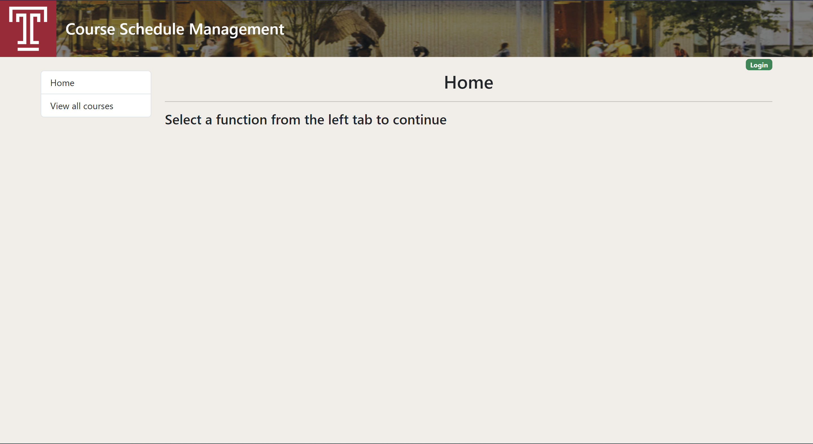
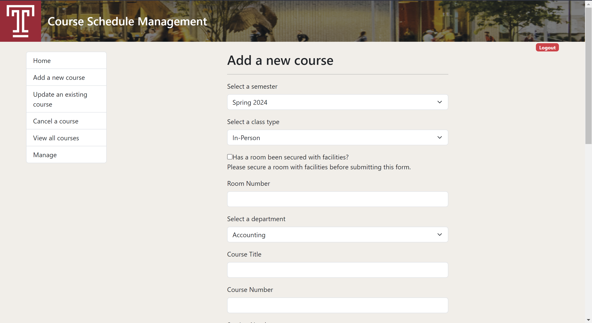
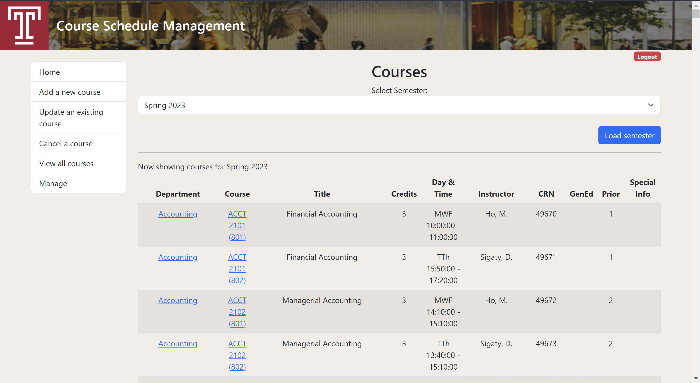
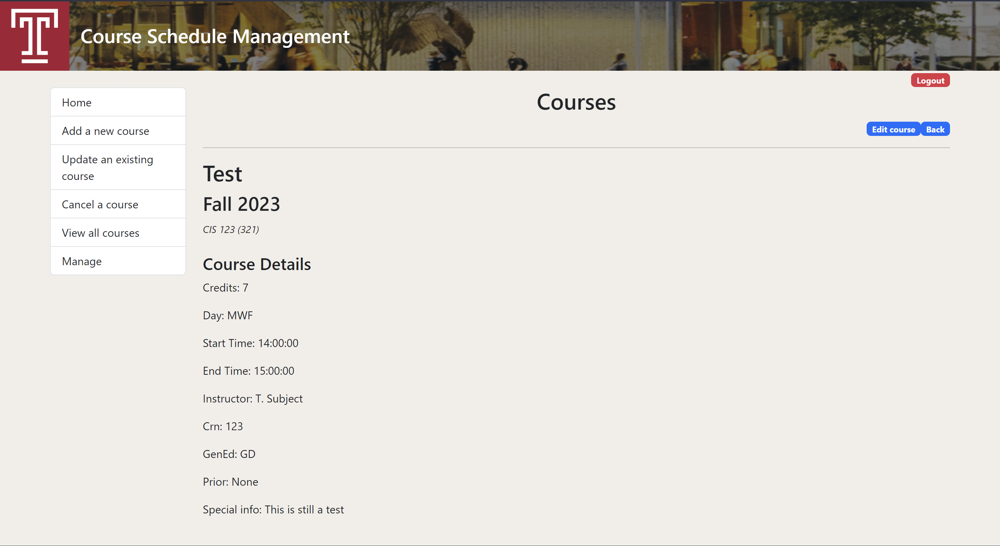

# Course Schedule Management

## Description

A React based web project meant to organize course schedules at Temple University Japan.

## Technologies

#### Front-end:
- React.js
  - [React Router](https://reactrouter.com/)
- Bootstrap
#### Back-end:
- Python
  - [Flask](https://flask.palletsprojects.com/en/)
- MySQL

## Installation

To begin using the Course Schedule Management tool, follow these steps:

1. Clone this repository:
   ```bash
   git clone https://github.com/kenichisutan/course-schedule-management.git
    ```

2. Navigate to the project front-end directory:
   ```bash
   cd course-schedule-management/course-schedule-management-frontend
    ```

3. Install the required dependencies:
    ```bash
   npm install
    ```

4. Start the development server:
    ```bash
    npm start
     ```
   
5. Navigate to the project back-end directory:
   ```bash
   cd course-schedule-management/course-schedule-management-backend
    ```
   
6. Run the back-end server:
   ```bash
   python app.py
    ```
   
7. Setup database through provided SQL file:
    ```
    course-schedule-management/course-schedule-management-backend/sql/database-creation.sql
    ```
   
8. Ensure local mySQL database is running:
    ```
    user: root
    password: 12345678
    ```

## Usage

After starting the development server, open your web browser and go to http://localhost:3000.
The front end will be served from http://localhost:5000.

You can now interact with the Course Schedule Management tool.

## Gallery




